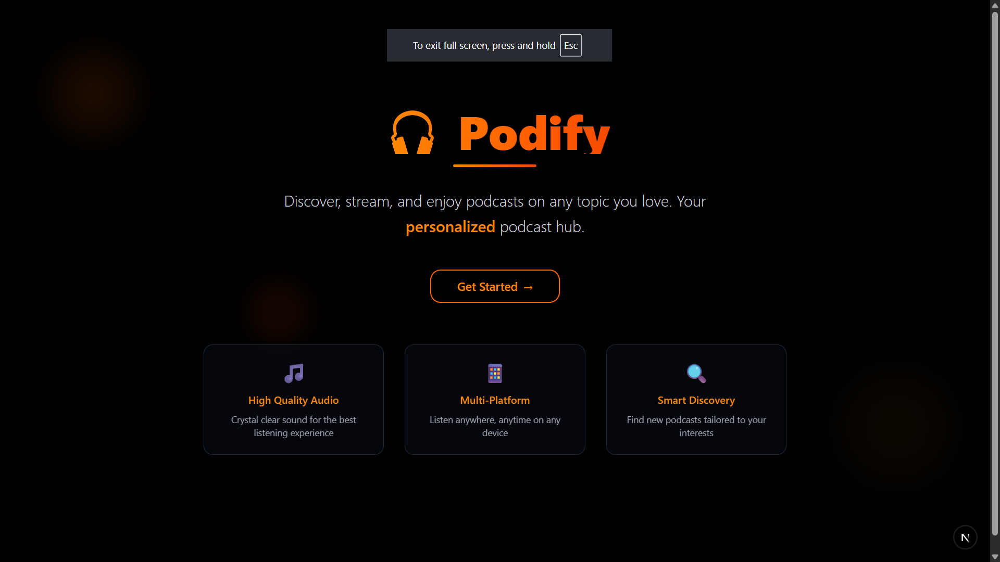
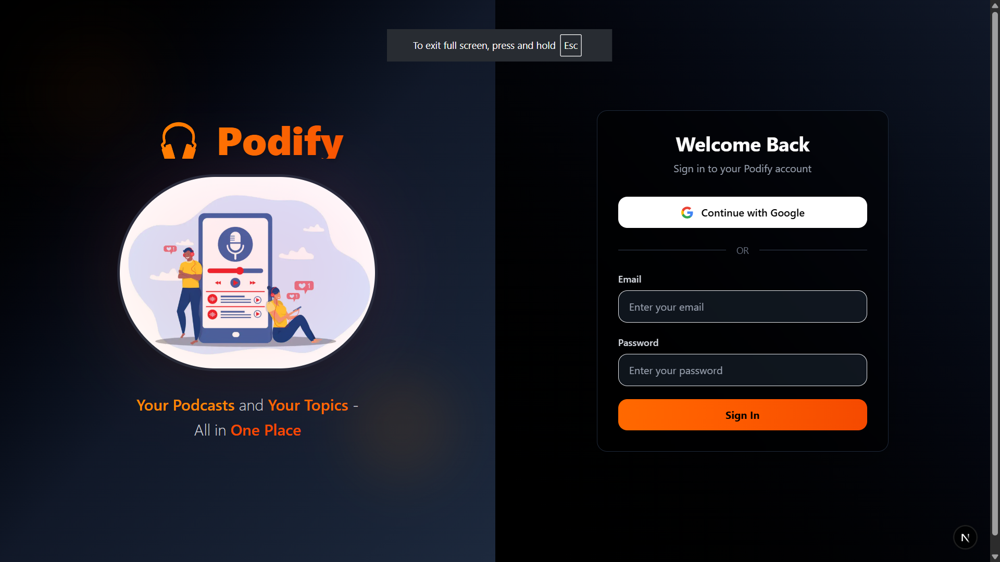
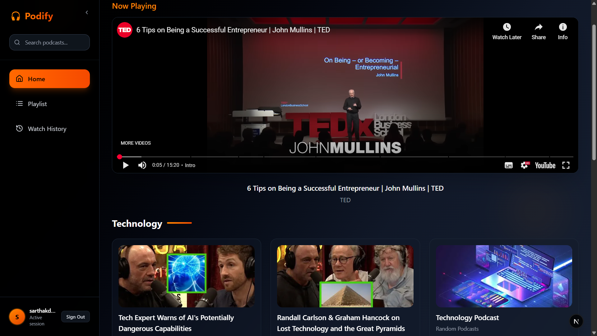

# 🎧 Podify – Your Personalized Podcast Hub

## 🚀 Summary

**Podify** is a next-gen podcast platform that delivers **personalized, curated podcasts** based on your interests. It tracks your listening habits, fetches relevant podcasts from YouTube, and refreshes content daily—ensuring a seamless and engaging listening experience.

## 🎬 Preview

## 🛠 Tech Stack

- **Frontend:** Next.js, React.js, TypeScript, Sass, NextAuth.js (OAuth)
- **Backend:** Java, Spring Boot, PostgreSQL (User & Topic Management), MongoDB (Podcast Storage)
- **APIs & Tools:** YouTube Data API v3, REST APIs, Scheduled Tasks, OAuth Authentication

## ✨ Features

- 🎯 **Personalized recommendations** based on user-selected topics
- 📂 **Topic-based organization** of podcasts for easy discovery
- 🔄 **Daily refresh** of podcasts to keep content fresh and relevant
- ⏱ **Watch history & progress tracking** per user
- 📺 **Embedded video player** with smooth playback and progress syncing
- 🔐 **OAuth login via Google** for secure authentication

## ⚙️ How It Works

1. Users select topics → preferences saved in PostgreSQL.
2. Backend fetches top podcasts for each topic from MongoDB.
3. If podcasts are missing or outdated → fetches new ones from YouTube & updates MongoDB.
4. Frontend dynamically displays **personalized podcast lists**.
5. Play podcasts directly via the embedded video player → progress synced to backend.
6. Scheduled **daily refresh** ensures fresh content while preserving user history.

## 💡 Why Podify?

Podify isn’t just a podcast app—it’s a **smart, personalized podcast experience** that adapts to your interests and keeps your listening journey fresh every day.
